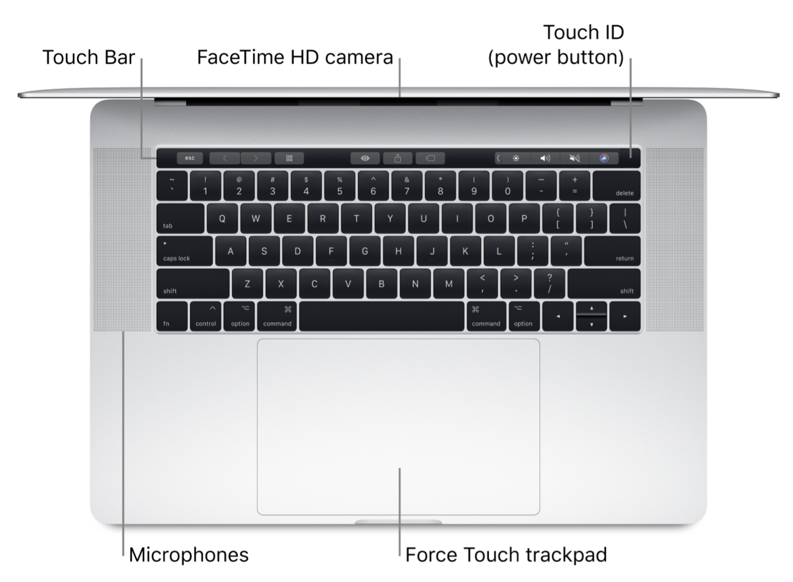
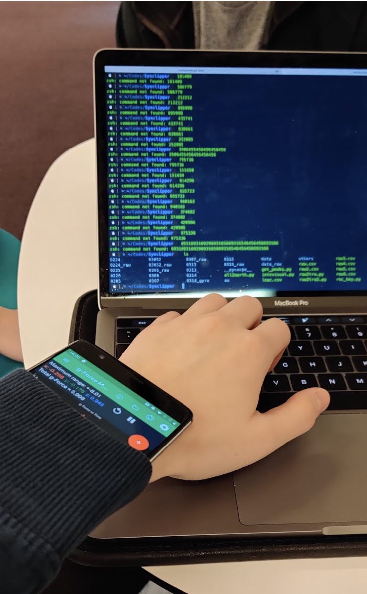
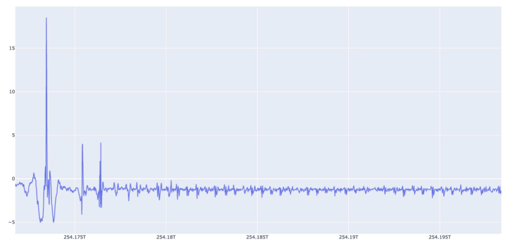
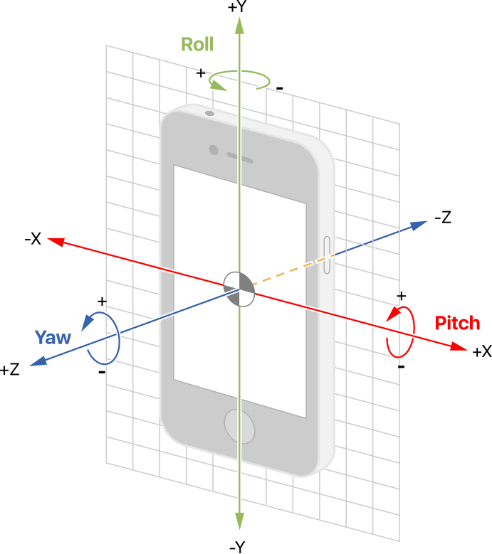

# Keyboard Snooping from Audio and Motion Sensor Data

*UCLA ECE 209AS Project, Winter 2020*

|	Authors		|
| ---------------------	|
| An Le			|
| Eugene Chu		|
| Zixuan Zhong		|		


## Table of Contents

* [Abstract](#abstract)
* [1. Introduction](#introduction)
* [2. Literature Review](#literature-review)
* [3. Technical Approaches](#technical-approaches)
* [4. Task 1: Identify Single Keys](#task-1)
* [5. Task 2: Identify 6-Digit PINs](#task-2)
* [6. Task 3: Identify Typing Scenarios](#task-3)
* [7. Evaluation](#evaluation)
* [8. Contributions](#contributions)
* [References](#references)

## Abstract

The problem of keyboard acoustic emanations has shown the possibility of figuring out what a user is typing through keystroke sounds. On the other hand, with the popularity of wearable devices like Apple Watch and Samsung Galaxy Watch, more attack vectors might be exploited. In this project, we present and explore a keyboard snooping attack that utilizes keystroke sounds and motion sensor data collected from compromised mobile phones and wearable devices to determine what a user is typing, as well as their intended task.

<h2 id="introduction">
1. Introduction
</h2>

### 1.1. Goals and Aims

#### 1.1.1. Overall Project Goals

The overall project goals of this project include:

1. To implement some of the keyboard snooping attacks that use audio data only
2. To explore which motion sensor(s) best suit the keyboard snooping attack
3. To try different ways of sensor fusion of microphone and motion sensor(s)
4. To simulate multiple keyboard snooping attacks using sensor fusion

#### 1.1.2. Specific Aims

The specific aims of this project include three tasks:

1. To build an audio-only model which identifies single keys ([Task 1](#task-1))
2. To build a sensor fusion model which identifies 6-digit PINs ([Task 2](#task-2))
3. To build a sensor fusion model which identifies different kinds of typing scenarios (like emailing, gaming, and chatting) ([Task 3](#task-3))
4. To test these models and perform quantitative evaluations

<h2 id="literature-review">
2. Literature Review
</h2>

### 2.1. Keyboard Acoustic Emanations (2004) <sup>[1]</sup>

#### 2.1.1. Objective

- Show it is possible to eavesdrop different types of keyboards and keypads via acoustic emanations

#### 2.1.2. Method

- Use a microphone to record the sound of each key
- Extract touch peak from audio and perform FFT
- Train NN classifier on key-feature pairs to identify keys
- Repeat for other types of keyboards and various distances

#### 2.1.3. Results

- 79% accuracy for {a-z, ';', ',', '.', '/'}
- Accuracy not significantly affected up to 15m
- Degraded accuracy when attacking keyboard using NN trained on another keyboard
- Typing style only affects accuracy slightly
- PC more vulnerable than a notebook, but less than a phone and ATM pads

### 2.2. Don't Skype & Type! Acoustic Eavesdropping in Voice-Over-IP <sup>[5]</sup>

#### 2.2.1. Objective

- Identify random keystrokes over Skype, given typing style and keyboard model

#### 2.2.2. Method

- Consider different attack scenarios
    - Complete profiling
    - User profiling
    - Model profiling
- Record Skype output
- Perform data segmentation to isolate key sounds
- Use MFCC to extract audio features
- Use k-NN classifier to infer target device
- Use LR classifier to identify keystrokes
- Collect data from users
    - Hunt and Peck, Touch typing styles

#### 2.2.3. Results

- 91.7% top-5 accuracy
- \> 90% accuracy when sample length > 20ms
- Better accuracy on higher-quality models such as MacBook Pro
- In model profiling scenario, 60% keystroke accuracy after 10 guesses
    - Still better than random guessing
- Good performance with a voice to keystroke ratio < 0dB
-  fewer tries needed to crack 10-letter password than brute force
   
### 2.3. Activity classification using a single wrist-worn accelerometer  <sup>[8]</sup>

#### 2.3.1. Objective
- This paper investigates the use of a single wrist- worn sensor to detect five daily activities.

#### 2.3.2. Method

- The paper compares two models: “Decision Tree C4.5” and “1-layer FC network” for classification of 5 tasks
      -  sitting, standing, lying, walking, and running
- Using four different sets of features [time domain], [freq domain]
     1) [min, dx, dy, dz], [coefficient sum, spectral energy, spectral entropy]
     2) [mean, std, variance, dx, dy, dz, correlation matirx], [spectral energy, spectral entropy]
     3) Set 1 + Set 2 with CFS evaluation
     4) [mean, min, correlation xy, dx, dy], [coefficient sum]
  
#### 2.3.3. Results

   - Using *Correlation-based Feature Selection* gives the best accuracy of 94.13% and F-1 score of 0.91.
   - Although one wrist worn accelerometer can be used to identify activity of a user, only simple activities can be detected.
   - More complex activities or those that involve detailed hand movements may require other sensors for additional context. 

### 2.4. A Comprehensive Study of Activity Recognition Using Accelerometers <sup>[9]</sup>

#### 2.4.1. Objective

- The paper surveys and evaluates methods of activity recognition using accelerometers.

#### 2.4.2. Method

- Using three publicly available data-sets, the paper answers some open questions in literature:
    - Structured vs “independently and identically distributed" models?
    - Are the so-far approaches genuinely robust across different contexts and activities? 
    - What is the minimum sampling rate required to get good classification performance?
    
#### 2.4.3. Results

   - Incorporating lower sampling frequencies does not worsen classification performance.
   - The use of longer (5-7 secs) feature windows for feature extraction can help the classification.
   - Structured models capture a greater portion of temporal context.

<h2 id="technical-approaches">
3. Technical Approaches
</h2>

### 3.1. Algorithms

To process (lossless) audio data, we first read the wave data and extract the peaks which are generated at the moment the user's finger touches the keys. Second, we perform a Fast Fourier Transform (FFT) on every sample that contains only about 25-milliseconds-long wave data to get wave data in the frequency domain. Finally, the frequency-domain audio data are put into a neural network classifier for training.

To add motion sensor data, many things need to be considered. First, it is intuitive that we want the displacement information from the motion sensor data, should we extract the displacement from raw data manually or directly put raw data into neural networks? There are multiple kinds of motion sensors, including accelerometer, gravimeter, or gyroscope sensors, which one(s) should we use? To find the answers to those questions, we conducted a lot of experiments during the implementation of [Task 2](#task-2) and results will be discussed in the section for [Task 2](#task-2).

In terms of sensor fusion, there are also multiple ways. For example, we could build a model which accepts both audio data and motion sensor data, or we may train two separate models, one only for audio data and the other only for motion sensor data, and perform Maximum Likelihood Tree Search (MLTS) to compute the final predictions based on the results from the two models. We could not know which method might give better results at the beginning of the project so both methods were tried and their results will be discussed in the section for [Task 2](#task-2).

### 3.2. Datasets

For [Task 1](#task-1), the dataset contains more than 4,000 samples, each of which is for a single key and has an audio wave file.

For [Task 2](#task-2), the dataset contains more than 700 samples, each of which is for a 6-digit PIN and has an audio file and five motion data files (there are 5 intervals between 6 peaks).

For [Task 3](#task-3), the dataset contains about 90 samples, each of which contains a 30 seconds long audio file and corresponding motion sensor data.

### 3.3. Platforms

We wrote a python program to used the built-in microphone of Macbook Pro to control the audio recording. The location of the microphone is shown below.



*Diagram showing the location of the microphone on a Macbook Pro 2017. ([source](https://help.apple.com/macbookprothunderbolt3/late-2017/#/apd2182293a1))*

To collect motion sensor data, an Android app called “Physical Toolbox Suite” meets all of our needs and we put an Android phone on our wrist to simulate a smartwatch, as shown below. The platform we used for machine learning is Keras.



*Collection of accelerometer data.*

<h2 id="task-1">
4. Task 1: Identify Single Keys
</h2>

### 4.1. Recording and Keylogging

We wrote a python script that saves both key strokes as well as the audio information recorded with the built-in microphone. The script outputs two files, the audio waveform (.wav) and the keylog (.csv). The figure below shows the waveform of an audio file, where the initial large spike corresponds to the [SPACE] key we use as a synchronization label.



*Waveform of a data sample.*

### 4.2. Preprocessing

To preprocess the audio, we first trim off 0.1 sec off both ends to remove any stray enter keys. Next, we set a magnitude threshold and enforce a minimum time between keystrokes to extract the push peaks and exclude the softer release peaks. Then, for each peak, we extract audio samples from 5 ms before the peak to 20 ms after the peak. For feature extraction, we apply FFT on 20 ms sliding windows with a stride of 1 ms. Finally, we standardize all of the features.

### 4.3. Key Classifier Architecture

Our key classifier is an MLP with two fully-connected hidden layers of size 64, a 50% dropout layer, and a softmax layer of size 36, which covers the keys `a-z` and `0-9`. The loss function for this model is categorical cross-entropy.

### 4.5. Training and Result

The dataset for this task consists of 4807 total keystrokes (a-z, 0-9) recorded by a single person on a MacBook using its internal microphones. We split the dataset into 70% training, 15% validation, and 15% test. We trained our key classifier on an GeForce RTX 2070 GPU for 100 epochs with a batch size of 128 and saved the model with the lowest validation loss. We obtained a keystroke accuracy ranging from **96%** and **98%**. If we train an averaging ensemble of 5 (initialized differently), the accuracy increases to **99%**. Our accuracy vastly exceeds the 79% attained in Keyboard Acoustic Emanations [1] since the authors used a window size of 2 ms instead of 20 ms, resulting in much smaller input features.

<h2 id="task-2">
5. Task 2: Identify 6-Digit PINs
</h2>

### 5.1. Displacement Information Extraction

Through [Task 1](#task-1), we could identity keys from audio data. However, we want to make the prediction more accurate by adding motion sensor data. 

Motion sensor data provide information of the movement of the user's (left) hand. So, we want to get the displacement information. There are multiple approaches.


*Diagram showing the coordinate and rotation axes for the phone. ([source](https://developer.apple.com/documentation/coremotion/getting_processed_device-motion_data/understanding_reference_frames_and_device_attitude))*

Most sensor data produced by the phone are 3-dimensional and in the device's frame. In order to get accelerometer data in the world's frame, we need to record both the linear accelerometer data and orientation data simultaneously, which, unfortunately, resulted in a low sampling rate.

Even though we do not care that much about the sampling rate. The displacement calculation, double integration, also result in a large error. At the same time, transferring a sequence of data into a single value means we have to lose details.

So, manually extracting displacement data is not feasible. We directly put all raw data into the machine learning model for training and testing.

### 5.2. Motion Sensor Selection

Another question is among the different types of motion sensors, including accelerometer, gyroscope, or linear accelerometer, which one should we use?

To find the most appropriate sensor, we built three neural network models, each of which used one kind of sensor. We found that gyroscope data cannot be synchronized well because their peaks do not occur at the same time as audio peaks. accelerometer data and linear accelerometer data are similar except that linear accelerometer excluded the gravity force. The result showed that using the accelerometer is better than the linear accelerometer. We thought that one reason could be that the gravity force provided some information on the orientation which could be utilized by the neural network.

### 5.3. Synchronization

Because the recording is started with a heavy press of the SPACE key, the starting point could be synchronized by finding the same peak in both audio wave and the z-axis of accelerometer data.

After align these two sequences of data, we cut these data into groups, separated by the timestamps of the ENTER key. 

Then, for each group, we try to find 6 peaks, which indicate the moments when the 6 keys are being pressed. And, 6 peaks give us 5 intervals. we cut the accelerometer into the five intervals according to the 6 timestamps.

### 5.4. Labeling

Labels of the audio data are from key logs directly. For example, if the PIN is "840364", the audio wave file is "840364.wave.csv".

Labels of the five accelerometer data are 2-dimensional vectors. First, we encode each key to a 2D coordinate: 

| key	| 2D coordinate |
| ---- | ------------- |
| 0		| (0, 0) |
| 1		| (-1, 1)|
| 2		| (0, 1) |
| 3		| (1, 1) |
| 4		| (-1, 2)|
| 5		| (0, 2) |
| 6		| (1, 2)|
| 7		| (-1, 3)|
| 8		| (0, 3)|
| 9		| (1, 3)|

Then the five key pairs <8,4>, <4, 0>, <0, 3>, <3, 6>, and <6, 4> are labeled as (-1, -1), (1, -2), (1, 1), (0, 1), and (-2, 0). So the five accelerometer data files are "0.84.-1.-1.acce.csv", "1.40.1.-2.acce.csv", "2.03.1.1.csv", "3.36.0.1.acce.csv", and "4.64.-2.0.csv".

### 5.5. Preprocessing

For audio preprocessing, we apply the same steps as in Task 1. For accelerometer preprocessing, we first obtain five accelerometer segments between the push peaks. At first, we attempted to take the FFT of the segments but failed to attain a good accuracy. We believe the reason is the FFT fails to distinguish between opposite hand motions, which are reflected as flipped accelerometer signals in time domain and signals of identical magnitude in frequency domain. Instead, we fix the length of the accelerometer signals to 256 by resampling them.

### 5.6. Key Model and Displacement Estimator Architecture

This time, we train two models: a key classifier and a displacement estimator. We use the same key classifier as in Task 1 except for the last layer, which has 10 neurons for the numpad keys 0-9. The displacement estimator has the same architecture as the key classifier, except the output layer is linear with 2 outputs representing 2D displacement. The loss function of the latter model is mean squared error.

### 5.7. Training and Result

We recorded a new dataset consisting of keystroke audio and accelerator data from two subjects on two different USB keyboards placed next to the same MacBook hosting the recording script. We have 718 PINs of length 6. As before, we apply a 70% training, 15% validation, and 15% test split. Applying the same training conditions as Task 1, we obtain a keystroke accuracy of *84.1%* and a top-3 accuracy of *95.1%*. The displacement model has an accuracy of *80.8%* after rounding the output, and a loss of *0.172*.

### 5.8. Maximum Likelihood Tree Search (MLTS)

How do we improve the PIN guess using the additional accelerometer information? We frame this as a maximum likelihood problem by interpreting the key classifier output as key probabilities and the displacement estimator as having a bivariate normal distribution with equal variances on both axes. Thus, the log likelihood (LL) expression to maximize is as follows:

%20%3D%20%5Csum_%7Bi%3D1%7D%5E%7B%7CG%7C%7D%20%5Clog(p(k_i%20%3D%20g_i))%20-%20c%20%5Csum_%7Bi%3D2%7D%5E%7B%7CG%7C%7D%20%7Cd_i%20-%20%5Chat%7Bd_i%7D%7C%5E2%24)

where:

 is the PIN subguess with  as the th key

 is the true PIN with  as the th key

 represents the softmax outputs of the key classifier on the 's

 is the reliability constant of the displacement estimator

 is the true displacement from  to 

 is the estimate of above


Two critical observations are that partial sums can be computed from partial guesses, and each subterm is effectively negative. This allows us to prune unlikely subguesses and avoid searching the entire space of  or 1 million key combinations. We present the Maximum Likelihood Tree Search algorithm (MLTS):

```psuedocode
Set best guess to most probable 6-key PIN according to key classifier
Set max LL to LL of best guess
Add [0], [1], ... [9] to subguess stack
While stack is not empty:
	Pop subguess from stack
	Find LL of subguess
	If current LL <= max LL then continue
	If len(subguess) == 6:
		If current LL > max LL:
			Set max LL to current LL
			Set best guess to current subguess
			Continue
	For i in 0..9:
		Push append(subguess, i) to stack
```

MLTS is essentially DFS with log likelihood computations for each node, starting with 1-key subguesses. It keeps track of the best 6-key guess according to its LL. The initial goal is set to the LL of the 6-key guess suggested by the audio-only classifier. If the algorithm encounters a subguess whose LL is less than or equal to the maximum found so far, every subsequent guess starting with the subguess is rejected since we know that adding more subterms never causes the LL to rise.

### 5.8. Evaluation after Audio and Accelerometer Fusion

We evaluate our new algorithm with  = 1 (we leave the optimization of  to future work). Using the dataset specified in section 5.6, the keystroke accuracy increases from **84.1%** to **91.8%** with MLTS. If we consider the problem of guessing the entire 6-key PIN in 5 attempts, the success rate is **83.3%**.

### 5.9. Evaluation on Additional Test Set

Now we test both models and MLTS on a new dataset that was recorded by a third person on a third keyboard. Unsurprisingly, the keystroke accuracy is down to **13.6%**, barely better than random guessing (10%). Even after incorporating accelerometer data and MLTS, the accuracy remains at **13.6%**. However, the displacement estimator did not perform as badly, with an accuracy of **51.8%** and a loss of **0.420**, since hand movement was fairly consistent across all subjects. If we set  to 100, greatly prioritizing the displacement estimate, the accuracy improves to **33.3%**. This implies that the information gain from adding accelerometer data enables attackers to recover the PIN given a sufficient number of attempts.

<h2 id="task-3">
6. Task 3: Identify Typing Scenarios
</h2>

### 6.1. Sensor hardware and software
In this task we collect sensor fusion data from three user tasks (gaming, messaging, emailing) for classification. The sensors used are the microphone on a Macbook Pro 2017 and the Physical Toolbox Suite application on an Android phone. Furthermore, we have also applied the steps within [section 5.1](#5.3.-synchronization) for synchronizing the audio waveform and the acceleration data. Each sample is labeled with one-hot labeling of 3 classes. 

### 6.2. Preprocessing and Architecture
Compared to Task 2, which focuses on information around keypresses, task 3 requires the entire 30 second data as input. Thus, the acceleration and audio information contains too much information to directly input into machine learning models as a feature space. Therefore, we implement preprocessing on both datasets to reduce feature size:

- Audio: We perform Fourier Transform with window size of 20ms and stride of 1ms, then take the average of the sliding windows. This results in 511 audio features.
- Accel: Since each sample of accelerometer data contains (x,y,z) vectors, we take the mean and standard deviation of every 300 samples. This results in 120 acceleration features.

The neural network architecture and parameters are as follows:
- Two FC layers with 16 nodes each, with 0.5 dropout and batchnorm
- Loss function: categorical cross-entropy
- Train-val split: 85%-15%
- Batch size:  10
- Epochs: 100

### 6.3. Machine Learning and Result
The results are shown in Figure 1. It can be seen that our model trains and validates with high accuracy, but it may be overfitted. However, we can see from the plot that the first twenty epochs give a drastic decrease in the training loss, which shows that our NN model does in fact learn with our selected features. We believe that the model too easily converges because of the small dataset.

However, intuitively we can give some insights into how the model interprets the features. The three tasks (gaming, messaging, emailing) have slightly different acceleration and audio profiles, as discussed below:

- Task classification is also dependent on the key press intervals (Intuition):
- Gaming tasks have constant key presses limited to certain keys (little acceleration change)
- Messaging has multiple keys pressed clustered in short intervals (requires the other person to reply)
- Emailing tasks are have more constant typing over a longer period (longer sentences)

Therefore, the chosen features in our preprocessing phase can represent the differences between the three tasks. Our audio input, after FFT, should have larger magnitudes for tasks that consist of continuous typing, i.e. gaming and emailing. While the accelerometer data should distinguish between tasks that have a relatively stable hand location (gaming) and those that require more hand movement due to the larger key space (messaging and emailing).


<h2 id="evaluation">
7. Evaluation
</h2>

### 7.1. Success Metrics and Key Findings

### 7.4. Prior Work Examples and Relative Novelty

### 7.5. Strengths, Weakness, and Future Directions

The strengths of the project are:

1. We implemented two keyboard snooping attacks, including an audio-only one and a sensor fusion one.
2. We tried different ways of sensor fusion.
3. The final model has high accuracy

The project also has some weakness:

1. Applicability. Samples from limited number of hardware.
2. The model requires high sampling rate which is hard to be achieved
3. The Victim may not use the hand with watch to type

Some possible future directions: 

1. To collect more data samples
2. To collect data samples from different hardware devices
3. To identity the user's emotion while typing using motion sensor and microphone

<h2 id="contributions">
8. Contributions
</h2>

| Name 		| Contributions 			|
| ----------	| -----------------------	|
| An Le 		| Survey of Prior Work, Machine Learning (Task 1 & 2), Maximum Likelihood Search Algorithm (Task 2)|
| Eugene Chu 	| Dataset Generation (Task 1 & 2 & 3), Machine Learning (Task 3)|
| Zixuan Zhong | Explorations on Motion Sensors (Frame Conversion, Double Integration, and Sensor Selection), Dataset Generation (Task 1 & 2), and Dataset Synchronization (Task 1 & 2 & 3)|
	

## References
[1] D. Asonov and R. Agrawal, “Keyboard acoustic emanations,” in IEEE Symposium on  Security and  Privacy,  2004.  Proceedings. 2004.    IEEE, 2004, pp. 3–11.

[2] L.  Zhuang,  F.  Zhou,  and  J.  D.  Tygar,  “Keyboard acoustic emanations revisited,” ACM  Transactions on  Information and System Security (TISSEC), vol. 13, no. 1, pp. 1–26, 2009.

[3] P.  Marquardt,  A.  Verma,  H.  Carter,  and  P.  Traynor,  “(sp)iphone:  Decoding vibrations from nearby keyboards using mobile phone accelerometers,” in Proceedings of the 18th ACM conference on Computer and communications security,  2011, pp. 551–562.

[4] J.  Liu,  Y.  Wang,  G.  Kar,  Y.  Chen,  J.  Yang,  and  M.  Gruteser, “Snooping keystrokes with mm-level audio ranging on a  single phone,”  in Proceedings of the  21st  Annual  International Conference on  Mobile  Computing and  Networking,  2015,  pp.142–154.

[5] A.  Compagno,  M.  Conti,  D.  Lain,  and  G.  Tsudik,  “Don’t skype  &  type!  acoustic eavesdropping in voice-over-ip,”  in Proceedings of the 2017 ACM on Asia Conference on Computer and Communications Security, 2017, pp. 703–715.

[6] K.  Jin,  S.  Fang,  C.  Peng,  Z.  Teng,  X.  Mao,  L.  Zhang,  and X.  Li,  “Vivisnoop:  Someone is snooping your typing without seeing it!” in 2017 IEEE Conference on Communications and Network Security (CNS).    IEEE, 2017, pp. 1–9.

[7] T.  Giallanza,  T.  Siems,  E.  Smith,  E.  Gabrielsen,  I.  Johnson, M. A. Thornton, and E. C. Larson, “Keyboard snooping from mobile phone arrays with mixed convolutional and recurrent neural networks,” Proceedings of the  ACM  on  Interactive, Mobile, Wearable and Ubiquitous Technologies, vol. 3, no. 2, pp. 1–22, 2019.

[8] S. Chernbumroong, A. S. Atkins and H. Yu, "Activity classification using a single wrist-worn accelerometer," 2011 5th International Conference on Software, Knowledge Information, Industrial Management and Applications (SKIMA) Proceedings, Benevento, 2011, pp. 1-6. doi: 10.1109/SKIMA.2011.6089975

[9] Twomey, Niall & Diethe, Tom & Fafoutis, Xenofon & Elsts, Atis & McConville, Ryan & Flach, Peter & Craddock, I.J.. (2018). A Comprehensive Study of Activity Recognition using Accelerometers. 10.20944/preprints201803.0147.v1. 
